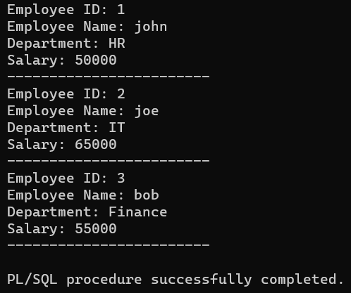

# Ex. No: 6 Creating Cursors using PL/SQL
## DATE:
### AIM: 
To create a cursor using PL/SQL.
### Algorithm/Procedure:
1. Create employee table with following attributes (empid NUMBER, empname VARCHAR(10), dept VARCHAR(10),salary NUMBER);
2. Create a cursor named as employee_cursor
3. Using cursor read each record and display the result
4. Close the cursor
### Program:
### Create employee table
```
Create employee table
create table employeee((empid NUMBER, empname VARCHAR(10), dept VARCHAR(10),salary NUMBER);
insert into employeee values(1,'John','HR',50000);
insert into employeee values(2,'joe','IT',65000);
insert into employeee values(3,'Bob','Finance',55000));
```
### PLSQL Cursor code
```
set serveroutput on
declare
cursor employee_cursor is
select empid,empname,dept,salary
from employee;
empid number;
empname varchar(90);
dept varchar(90);
salary number;
begin
open employee_cursor;
loop
fetch employee_cursor into empid,empname,dept,salary;
exit when employee_cursor%notfound;
dbms_output.put_line('Employee ID: '||empid);
dbms_output.put_line('Employee Name: '||empname);
dbms_output.put_line('Department: '||dept);
dbms_output.put_line('Salary: '||salary);
dbms_output.put_line('------------------------');
end loop;
close employee_cursor;
end;
/
```
### Output:

## Result:
Thus a cursor using PL/SQL is created successfully.
